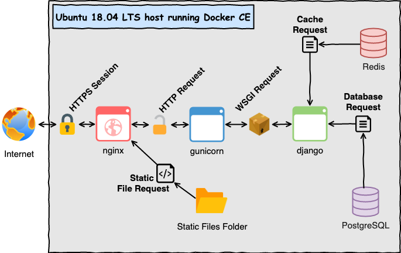

#  Docker Django Server

My personal dockerized django server that I use in personal projects as a backend.

## Architecture Notes:



- [Nginx](https://www.nginx.com/):
  - Acts as a fast and lightweight [reverse proxy](https://en.wikipedia.org/wiki/Reverse_proxy)
  - Provides HTTPS support through [Let's Encrypt](https://letsencrypt.org/) for free
  - Serves django application static files (no need for [WhiteNoise](http://whitenoise.evans.io/en/stable/))
- [Gunicorn](https://gunicorn.org/)
  - Python [WSGI](https://en.wikipedia.org/wiki/Web_Server_Gateway_Interface) HTTP Server for UNIX
  - Manages django application thread pool
- [PostgreSQL](https://www.postgresql.org/)
  - SQL compliant database with django community support
- [Redis](https://redis.io/)
  - PostgreSQL request caching through django for UNIX

TODO: `requirements.base` listing

TODO: `docker-compose.yml` listing

## Development Notes:

### [1] Environment Setup:

- [Ubuntu 18.04 LTS amd64 ISO download](https://ubuntu.com/download/server/thank-you?version=18.04.4&architecture=amd64)
- [Docker CE Install](https://docs.docker.com/install/linux/docker-ce/ubuntu/)
- [Docker Compose Install](https://docs.docker.com/compose/install/)
- Python3.8 and [pipenv](https://pipenv-fork.readthedocs.io/) install:

```bash
sudo apt-get update && sudo apt-get upgrade
sudo apt-get install python3.8 python3-pip
python3.8 -m pip install --user pipenv
echo 'export PATH="${HOME}/.local/bin:$PATH"' >> ~/.bashrc
source ~/.bashrc
```

## Resources:

- [nginx admin handbook](https://github.com/trimstray/nginx-admins-handbook)